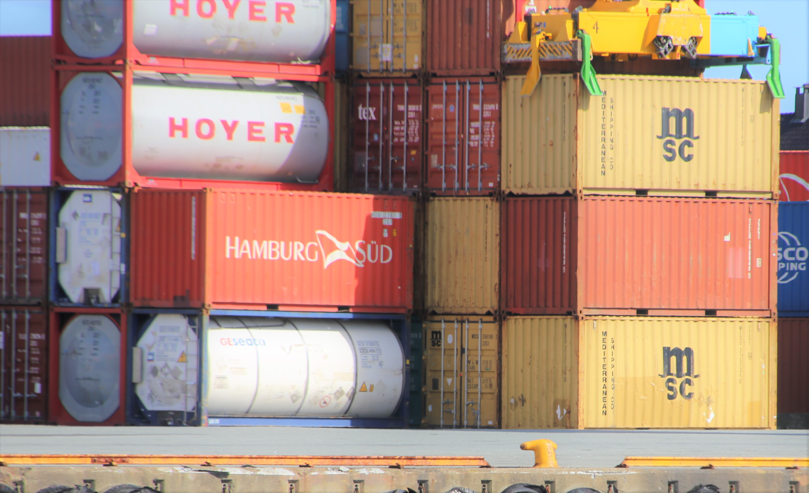

Nunc mi ipsum faucibus vitae aliquet nec ullamcorper. Odio eu feugiat pretium nibh ipsum consequat nisl vel pretium. Vehicula ipsum a arcu cursus vitae. Curabitur gravida arcu ac tortor dignissim convallis aenean et. Fermentum leo vel orci porta non.

## Mål med arbeidspakken

Lorem ipsum dolor sit amet, consectetur adipiscing elit, sed do eiusmod tempor incididunt ut labore et dolore magna aliqua. Facilisis leo vel fringilla est. Odio facilisis mauris sit amet. Egestas fringilla phasellus faucibus scelerisque eleifend. Urna neque viverra justo nec. Nisl purus in mollis nunc. Sit amet facilisis magna etiam tempor orci eu. Dolor magna eget est lorem ipsum. Arcu ac tortor dignissim convallis aenean et tortor at risus. Suspendisse sed nisi lacus sed. Aliquam faucibus purus in massa tempor nec feugiat.

## Utførelsen

Lorem ipsum dolor sit amet, consectetur adipiscing elit, sed do eiusmod tempor incididunt ut labore et dolore magna aliqua. Facilisis leo vel fringilla est. Odio facilisis mauris sit amet. Egestas fringilla phasellus faucibus scelerisque eleifend. Urna neque viverra justo nec. Nisl purus in mollis nunc. Sit amet facilisis magna etiam tempor orci eu. Dolor magna eget est lorem ipsum. Arcu ac tortor dignissim convallis aenean et tortor at risus. Suspendisse sed nisi lacus sed. Aliquam faucibus purus in massa tempor nec feugiat. Nunc mi ipsum faucibus vitae aliquet nec ullamcorper. Odio eu feugiat pretium nibh ipsum consequat nisl vel pretium. Vehicula ipsum a arcu cursus vitae. Consectetur lorem donec massa sapien faucibus et. Sed egestas egestas fringilla phasellus faucibus scelerisque eleifend donec. Curabitur gravida arcu ac tortor dignissim convallis aenean et. Fermentum leo vel orci porta non.

## Hva er resultatet?

I arbeidspakke 1 – Havnedata er det utviklet kartvisningsverktøy for bruk i havna. Arbeidspakken er en videreføring, og ferdigstilling av et prosjektarbeid som ble påbegynt i 2020 med finansiering fra Kystverket. Kartvisningsverktøyet som er utviklet kommuniserer direkte med felles nasjonal kartdatabase (SFKB) og viser alle havneobjekter fra registreringsinstruksen med egnede tegneregler i kart. Løsningen har en enkel og brukertilpasset funksjonalitet for administrativ ajourføring av objektene både i forhold til egenskaper og enkel geometri. Verktøyet er utviklet og prioritert i forhold til brukerbehovene i havna. Havnene og Kartverket har vært med i en arbeidsgruppe som har fulgt utviklingsarbeidet tett og bidratt i forhold til brukerbehov og prioritering.  

### Involverte parter
* Lorem ipsum
* Lorem ipsum
* Lorem ipsum
* Lorem ipsum
